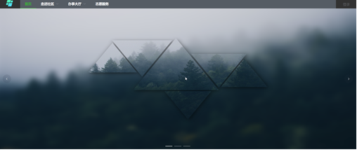
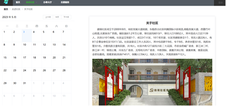
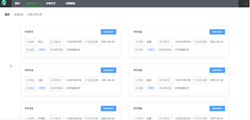
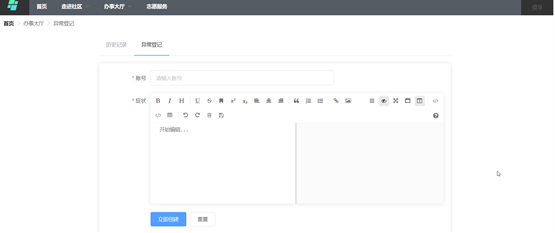

## 项目介绍
这个项目作为社区疫情防控系统的住户端，主要使用Vue框架，结合Element-UI组件库开发。
### 首页


### 关于社区

### 办公人员一览

### 登记界面



# virusweb

## Project setup
```
yarn install
```

### Compiles and hot-reloads for development
```
yarn serve
```

### Compiles and minifies for production
```
yarn build
```

### Lints and fixes files
```
yarn lint
```

### Customize configuration
See [Configuration Reference](https://cli.vuejs.org/config/).

